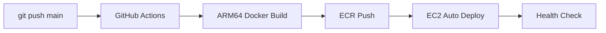

# Vibe Aggregator(Prompt Generator) API | ダッシュボード情報、気分、各種グラフのためのプロンプト生成API

タイムブロック単位、あるいは1日分（48個）のトランスクリプションや音響データを統合し、ChatGPT分析に適したプロンプトを生成するFastAPIアプリケーション

---

## 🗺️ ルーティング詳細

| 項目 | 値 | 説明 |
|------|-----|------|
| **🏷️ サービス名** | Vibe Aggregator API | プロンプト生成・データ統合 |
| **📦 機能** | Prompt Generator | ChatGPT分析用プロンプト生成 |
| | | |
| **🌐 外部アクセス（Nginx）** | | |
| └ 公開エンドポイント | `https://api.hey-watch.me/vibe-analysis/aggregator/` | ✅ 統一命名規則に準拠（2025-10-28） |
| └ Nginx設定ファイル | `/etc/nginx/sites-available/api.hey-watch.me` | |
| └ proxy_pass先 | `http://localhost:8009/` | 内部転送先 |
| └ タイムアウト | 180秒 | read/connect/send |
| | | |
| **🔌 API内部エンドポイント** | | |
| └ ヘルスチェック | `/health` | GET |
| └ **タイムブロックプロンプト生成** | `/generate-timeblock-prompt` | GET - Lambdaから呼ばれる |
| └ **失敗レコード作成** | `/create-failed-record` | POST - クォーター超過時 |
| └ **ダッシュボードサマリー** | `/generate-dashboard-summary` | GET - 累積分析用 |
| | | |
| **🐳 Docker/コンテナ** | | |
| └ コンテナ名 | `vibe-analysis-aggregator` | ✅ 統一命名規則 |
| └ ポート（内部） | 8009 | コンテナ内 |
| └ ポート（公開） | `127.0.0.1:8009:8009` | ローカルホストのみ |
| └ ヘルスチェック | `/health` | Docker healthcheck |
| | | |
| **☁️ AWS ECR** | | |
| └ リポジトリ名 | `watchme-vibe-analysis-aggregator` | ✅ 統一命名規則 |
| └ リージョン | ap-southeast-2 (Sydney) | |
| └ URI | `754724220380.dkr.ecr.ap-southeast-2.amazonaws.com/watchme-vibe-analysis-aggregator:latest` | |
| | | |
| **⚙️ systemd** | | |
| └ サービス名 | （コンテナ名に依存） | docker-compose管理 |
| └ 起動コマンド | `docker-compose up -d` | |
| └ 自動起動 | enabled | サーバー再起動時に自動起動 |
| | | |
| **📂 ディレクトリ** | | |
| └ ソースコード | `/Users/kaya.matsumoto/projects/watchme/api/vibe-analysis/aggregator` | ローカル |
| └ GitHubリポジトリ | `hey-watchme/api-vibe-aggregator` | |
| └ EC2配置場所 | `/home/ubuntu/vibe-analysis-aggregator` | run-prod.sh実行ディレクトリ |
| | | |
| **🔗 呼び出し元** | | |
| └ Lambda関数（タイムブロック） | `watchme-audio-worker` |  |
| └ 呼び出しURL（タイムブロック） | ✅ `https://api.hey-watch.me/vibe-analysis/aggregator/generate-timeblock-prompt` | |
| └ Lambda関数（ダッシュボード） | `watchme-dashboard-summary-worker` | タイムブロック完了時 |
| └ 呼び出しURL（ダッシュボード） | ✅ `https://api.hey-watch.me/vibe-analysis/aggregator/generate-dashboard-summary` |  |
| └ 環境変数 | `API_BASE_URL=https://api.hey-watch.me` | Lambda内 |

---

## 🚨 重要: デプロイ方法について

**このAPIは完全自動CI/CDパイプラインで管理されています。**
- ✅ mainブランチへのpushで自動的に本番環境にデプロイ
- ✅ 手動デプロイは不要（GitHub Actions が全て処理）
- ⚠️ 詳細は [CI/CDパイプライン](#cicd-パイプライン) セクションを参照

## 🐳 本番環境情報

- **ECRリポジトリ**: `754724220380.dkr.ecr.ap-southeast-2.amazonaws.com/watchme-vibe-analysis-aggregator`
- **コンテナ名**: `vibe-analysis-aggregator`
- **ポート**: 8009
- **公開URL**: `https://api.hey-watch.me/vibe-analysis/aggregator/`
- **デプロイ方式**: GitHub Actions → ECR → EC2（完全自動）

## 🚀 CI/CD パイプライン

### デプロイフロー（完全自動化）



### 開発者がやること

```bash
# 1. コード修正
code main.py

# 2. コミット＆プッシュ（これだけ！）
git add .
git commit -m "feat: 新機能追加"
git push origin main

# 3. 自動デプロイ完了を待つ（約5分）
# GitHub Actions: https://github.com/hey-watchme/api-vibe-aggregator/actions
```

### CI/CD設定詳細

- **ワークフローファイル**: `.github/workflows/deploy-to-ecr.yml`
- **必要なGitHub Secrets**: 設定済み（AWS認証、EC2接続）
- **アーキテクチャ**: ARM64対応（EC2 t4g.small）
- 詳細: [CI/CDドキュメント](#cicd-パイプライン詳細)

---

## 📋 詳細仕様書

**完全な仕様書**: [`API_DOCUMENTATION.md`](./API_DOCUMENTATION.md) をご参照ください

**更新履歴**: このREADME末尾の「変更履歴」セクションをご覧ください

## 🚀 クイックスタート

### 環境設定

```bash
# .envファイルを作成
cp .env.example .env

# .envファイルを編集してSupabase認証情報を設定
# SUPABASE_URL=https://your-project.supabase.co
# SUPABASE_KEY=your-anon-key
```

### インストール

```bash
# 仮想環境の作成と有効化
python3 -m venv venv
source venv/bin/activate

# 依存関係のインストール
pip install -r requirements.txt
```

### 起動

```bash
uvicorn main:app --host 0.0.0.0 --port 8009 --reload
```

## 📡 APIエンドポイント

### 本番環境URL
**ベースURL**: `https://api.hey-watch.me/vibe-analysis/aggregator`

### 利用可能なエンドポイント

#### ヘルスチェック
```bash
curl -X GET "https://api.hey-watch.me/vibe-analysis/aggregator/health"
```

#### タイムブロック単位プロンプト生成（✅ 修正完了）
30分単位のマルチモーダルプロンプト生成（ASR + SED + SER + 観測対象者情報）
```bash
curl -X GET "https://api.hey-watch.me/vibe-analysis/aggregator/generate-timeblock-prompt?device_id=9f7d6e27-98c3-4c19-bdfb-f7fda58b9a93&date=2025-09-01&time_block=16-00"
```

#### ⚠️ 将来分離予定のエンドポイント

以下のエンドポイントは次のフェーズで別APIに分離予定です：

- `/generate-dashboard-summary` - Dashboard Summary APIへ移動予定
- `/create-failed-record` - Vibe Scorer APIへ移動予定

### ローカル開発時のURL
開発環境では `http://localhost:8009` を使用してください。

### 成功レスポンス例

```json
{
  "status": "success",
  "message": "プロンプトが正常に生成され、データベースに保存されました。処理済み: 1個、欠損: 47個",
  "output_path": null
}
```


## ✅ 実装完了状況

### ✅ 完了済みエンドポイント

| エンドポイント | 機能 | 出力先 | データソース |
|---------------|------|-------------|-------------|
| `GET /health` | ヘルスチェック | - | - |
| `GET /generate-timeblock-prompt` | 30分単位の高精度プロンプト生成 | `audio_aggregator.vibe_aggregator_result` | `audio_features`テーブル（3種類の分析結果） |

### ✅ 実装完了機能

#### タイムブロック単位処理（/generate-timeblock-prompt）- v7.1.0対応

**v7.0.0-7.1.0での主要変更**：新テーブル構造への完全移行

**30分単位での高精度分析**:
- **マルチモーダルデータ統合**:
  - 発話内容（`audio_features.vibe_transcriber_result` - TEXT型）
  - 音響イベント（`audio_features.behavior_extractor_result` - JSONB型）
  - 音声特徴（`audio_features.emotion_extractor_result` - JSONB型）
  - 観測対象者情報（`subjects`テーブル）
- **コンテキスト重視**:
  - 時間帯判定（早朝/午前/午後/夕方/夜/深夜）
  - 観測対象者の属性を考慮した分析
- **保存先**:
  - `audio_aggregator.vibe_aggregator_result`（TEXT型）
  - Primary Key: `(device_id, date)` - **1日1レコード**で累積更新
- **重要な設計変更**:
  - ステータス管理は**Features APIが責任を持つ**（Aggregatorは更新しない）
  - 30分ごとに同じレコードを上書き更新

#### ⚠️ 次のフェーズで分離予定

- `/generate-dashboard-summary` - Dashboard Summary APIへ移動予定
- `/create-failed-record` - Vibe Scorer APIへ移動予定

### 🔄 WatchMeエコシステムでの位置づけ

#### タイムブロック単位処理フロー（v7.1.0）
```
audio_features (3種類の分析結果)
  ├─ vibe_transcriber_result (TEXT)
  ├─ behavior_extractor_result (JSONB)
  └─ emotion_extractor_result (JSONB)
           ↓
      [このAPI] - プロンプト生成
           ↓
  audio_aggregator.vibe_aggregator_result
           ↓
      Vibe Scorer API
```

**このAPIの役割（v7.1.0）**:
- `audio_features`テーブルから3種類の分析結果を読み込み
- マルチモーダルプロンプトを生成
- `audio_aggregator.vibe_aggregator_result`に保存（1日1レコード、30分ごとに累積更新）
- **ステータス管理はFeatures APIが実施**（このAPIは関与しない）

## 📁 データ構造（v7.1.0）

### 入力データ

#### audio_featuresテーブル（統合Features結果）
- `device_id`: デバイス識別子（TEXT）
- `date`: 日付（YYYY-MM-DD）
- `time_block`: 時間帯（例: "00-00", "00-30"）
- **`vibe_transcriber_result`**: 音声転写テキスト（TEXT型）
- **`behavior_extractor_result`**: 音響イベント分類結果（JSONB型）
  - `events`: YAMNet分類結果配列
    - `label`: イベント名（例: "Speech", "Music"）
    - `prob`: 確率（0.0〜1.0）
- **`emotion_extractor_result`**: 音声特徴データ（JSONB型）
  - OpenSMILE音声特徴の時系列データ
  - `timestamp`, `features`（Loudness、Jitterなど）
- `vibe_transcriber_status`, `behavior_extractor_status`, `emotion_extractor_status`: 各処理ステータス

#### subjectsテーブル（観測対象者情報）
- `subject_id`: 観測対象者ID
- `name`: 名前
- `age`: 年齢
- `gender`: 性別
- `notes`: 備考（学校、趣味など）

#### devicesテーブル（デバイス関連付け）
- `device_id`: デバイス識別子
- `subject_id`: 観測対象者ID（subjectsテーブルと関連）

### 出力データ

#### audio_aggregatorテーブル（集約結果）
- `device_id`: デバイス識別子（TEXT）
- `date`: 日付（YYYY-MM-DD）
- **Primary Key**: `(device_id, date)` - **1日1レコード**
- **`vibe_aggregator_result`**: 生成されたプロンプト（TEXT型）
  - マルチモーダル分析用プロンプト
  - 30分ごとに同じレコードを上書き更新
- `vibe_aggregator_processed_at`: 最終処理日時
- `created_at`: 作成日時
- `updated_at`: 更新日時

### プロンプト形式

生成されるプロンプトは、Vibe Scorer APIでの心理分析に最適化された構造化テキストです：
- **マルチモーダルデータ統合**：発話内容 + 音響イベント + 音声特徴
- **時間コンテキスト**：時間帯、観測対象者の属性
- **分析指示**：Vibe Score算出のためのガイドライン

## 🔧 環境変数

| 変数名 | 値 | 説明 |
|--------|-----|------|
| `SUPABASE_URL` | `https://your-project.supabase.co` | SupabaseプロジェクトURL |
| `SUPABASE_KEY` | `your-anon-key` | Supabase Anonymous Key |


## 📊 レスポンス例

### 成功時
```json
{
  "status": "success",
  "message": "プロンプトが正常に生成され、データベースに保存されました。処理済み: 5個、欠損: 43個",
  "output_path": null
}
```

### エラー時
```json
{
  "status": "error",
  "detail": "無効な日付形式です。YYYY-MM-DD形式で入力してください。"
}
```

## 🔄 処理フロー（v7.1.0）

### タイムブロック単位処理（/generate-timeblock-prompt）
1. **audio_featuresテーブルから読み込み**: 指定`(device_id, date, time_block)`の3種類の分析結果を取得
   - `vibe_transcriber_result`（TEXT）
   - `behavior_extractor_result`（JSONB）
   - `emotion_extractor_result`（JSONB）
2. **観測対象者情報の取得**: `devices` → `subjects`テーブルから属性情報を取得
3. **マルチモーダルプロンプト生成**: 3種類のデータ + 時間コンテキストを統合
4. **audio_aggregatorに保存**: `(device_id, date)`でUPSERT（30分ごとに同じレコードを上書き更新）

## 🛡️ 堅牢性

- **欠損ファイル対応**: ファイルが存在しない場合でも正常処理
- **空データ対応**: 空のログでも適切なプロンプト生成
- **エラーハンドリング**: 詳細なエラー情報とデバッグ機能
- **権限チェック**: ファイルアクセス権限の事前確認

## 🔧 技術仕様

- **Python**: 3.11.8
- **フレームワーク**: FastAPI
- **非同期処理**: aiohttp
- **データベース**: Supabase (PostgreSQL)
- **ファイル処理**: pathlib
- **ポート**: 8009
- **必須ライブラリ**: fastapi, uvicorn, pydantic, python-multipart, requests, aiohttp, supabase

## 📚 API ドキュメント

- **Swagger UI**: `https://api.hey-watch.me/vibe-analysis/aggregator/docs`
- **ReDoc**: `https://api.hey-watch.me/vibe-analysis/aggregator/redoc`

ローカル開発環境では `http://localhost:8009/docs` または `http://localhost:8009/redoc` を使用してください。

## 🚢 手動デプロイ手順（CI/CDを使わない場合）

**⚠️ 注意: 通常はCI/CDパイプラインが自動でデプロイするため、以下の手動作業は不要です。**
緊急時やCI/CDが使用できない場合のみ参照してください。

### 前提条件
1. **watchme-networkインフラストラクチャが起動済み**
2. **環境変数ファイル（.env）が配置済み**
   - `/home/ubuntu/vibe-analysis-aggregator/.env`
3. **AWS CLIが設定済み**

### デプロイ手順

#### 1. ローカルからECRへのデプロイ

```bash
# プロジェクトディレクトリに移動
cd /Users/kaya.matsumoto/api_gen-prompt_mood-chart_v1

# ECRへイメージをビルド＆プッシュ
./deploy-ecr.sh
```

#### 2. EC2サーバーでのデプロイ

##### 方法1: run-prod.shを使用（推奨）
```bash
# EC2サーバーにSSH接続
ssh -i ~/watchme-key.pem ubuntu@3.24.16.82

# デプロイスクリプトを実行
cd /home/ubuntu/vibe-analysis-aggregator
./run-prod.sh
```

##### 方法2: 手動でdocker-composeを使用
```bash
# ECRから最新イメージをプル
aws ecr get-login-password --region ap-southeast-2 | \
  docker login --username AWS --password-stdin \
  754724220380.dkr.ecr.ap-southeast-2.amazonaws.com

docker pull 754724220380.dkr.ecr.ap-southeast-2.amazonaws.com/watchme-vibe-analysis-aggregator:latest

# コンテナを再起動
docker-compose -f docker-compose.prod.yml down
docker-compose -f docker-compose.prod.yml up -d
```

### 初回セットアップ（新規環境の場合）

```bash
# 1. EC2にディレクトリ作成
ssh -i ~/watchme-key.pem ubuntu@3.24.16.82 'mkdir -p /home/ubuntu/vibe-analysis-aggregator'

# 2. 必要なファイルをコピー
scp -i ~/watchme-key.pem docker-compose.prod.yml ubuntu@3.24.16.82:/home/ubuntu/vibe-analysis-aggregator/
scp -i ~/watchme-key.pem run-prod.sh ubuntu@3.24.16.82:/home/ubuntu/vibe-analysis-aggregator/

# 3. .envファイルを作成
ssh -i ~/watchme-key.pem ubuntu@3.24.16.82
cat > /home/ubuntu/vibe-analysis-aggregator/.env << EOF
SUPABASE_URL=your-supabase-url
SUPABASE_KEY=your-supabase-key
EC2_BASE_URL=production
EOF

# 4. デプロイ実行
cd /home/ubuntu/vibe-analysis-aggregator
./run-prod.sh
```

### 動作確認

```bash
# ヘルスチェック（内部）
curl http://localhost:8009/health

# ヘルスチェック（外部）
curl https://api.hey-watch.me/vibe-analysis/aggregator/health

# コンテナ状態確認
docker ps | grep vibe-analysis-aggregator

# ログ確認
docker logs -f vibe-analysis-aggregator
```

### デプロイ成功確認（2025年9月3日）

```bash
# コンテナイメージ確認
$ docker inspect vibe-analysis-aggregator --format "{{.Config.Image}}"
754724220380.dkr.ecr.ap-southeast-2.amazonaws.com/watchme-vibe-analysis-aggregator:latest

# 外部アクセス確認
$ curl https://api.hey-watch.me/vibe-analysis/aggregator/health
{"status":"healthy","timestamp":"2025-09-03T12:48:06.409480"}
```

## 📖 CI/CD パイプライン詳細

### 🔧 CI/CDの仕組み

#### アーキテクチャ図

```
┌─────────────┐      ┌──────────────┐      ┌─────────┐      ┌──────────┐
│  Developer  │ push │    GitHub    │ auto │ GitHub  │ push │   AWS    │
│   (Local)   │ ───> │ Repository   │ ───> │ Actions │ ───> │   ECR    │
└─────────────┘      └──────────────┘      └─────────┘      └──────────┘
                                                 ↓
                                         ┌──────────────┐
                                         │ Build Docker │
                                         │    Image     │
                                         └──────────────┘

                     ┌──────────────────────────────────────┐
                     │        手動デプロイ（現時点）         │
                     │  EC2サーバーでrun-prod.sh実行        │
                     └──────────────────────────────────────┘
```

### 🚦 CI/CDワークフローの詳細

#### トリガー条件
- **自動実行**: mainブランチへのpush時
- **手動実行**: GitHub ActionsのUIから「Run workflow」

#### 実行ステップ

1. **コードのチェックアウト**
   - リポジトリの最新コードを取得

2. **AWS認証設定**
   - GitHub SecretsからAWS認証情報を取得
   - 一時的なセッションを確立

3. **ECRログイン**
   - AWS ECRへの認証を実行
   - Dockerクライアントを設定

4. **イメージビルド＆プッシュ**
   - `Dockerfile.prod`を使用してビルド
   - 2つのタグでプッシュ:
     - `latest`: 最新版として
     - `git-sha`: コミットハッシュ（履歴管理用）

5. **通知**
   - 成功/失敗をログに記録
   - 次のステップの案内を表示

### 🔐 セキュリティ設定

#### GitHub Secrets（必須設定）

リポジトリの **Settings > Secrets and variables > Actions** で設定:

| シークレット名 | 説明 | 使用場所 |
|--------------|------|---------|
| `AWS_ACCESS_KEY_ID` | AWS IAMユーザーのアクセスキーID | GitHub Actions実行時のみ |
| `AWS_SECRET_ACCESS_KEY` | AWS IAMユーザーのシークレットキー | GitHub Actions実行時のみ |

**重要**: これらのシークレットは暗号化され、GitHub Actions実行時のみアクセス可能

#### IAM権限要件

CI/CD用のIAMユーザーに必要な最小権限:

```json
{
  "Version": "2012-10-17",
  "Statement": [
    {
      "Effect": "Allow",
      "Action": [
        "ecr:GetAuthorizationToken",
        "ecr:BatchCheckLayerAvailability",
        "ecr:GetDownloadUrlForLayer",
        "ecr:PutImage",
        "ecr:InitiateLayerUpload",
        "ecr:UploadLayerPart",
        "ecr:CompleteLayerUpload"
      ],
      "Resource": [
        "arn:aws:ecr:ap-southeast-2:754724220380:repository/watchme-vibe-analysis-aggregator"
      ]
    }
  ]
}
```

### 📝 詳細な使用手順

#### 初回セットアップ（一度だけ）

1. **GitHub Secretsの設定**
   ```
   1. https://github.com/hey-watchme/api-vibe-aggregator を開く
   2. Settings → Secrets and variables → Actions
   3. "New repository secret"をクリック
   4. AWS_ACCESS_KEY_ID を追加
   5. AWS_SECRET_ACCESS_KEY を追加
   ```

2. **動作確認**
   ```bash
   # テスト用の小さな変更
   echo "# CI/CD test" >> README.md
   git add README.md
   git commit -m "test: CI/CD pipeline"
   git push origin main
   
   # GitHub Actionsタブで実行状況を確認
   ```

#### 通常のデプロイフロー

```bash
# 1. 開発作業
code main.py  # コード修正

# 2. コミット＆プッシュ（CI/CDトリガー）
git add .
git commit -m "feat: 新機能追加"
git push origin main

# 3. GitHub Actionsの確認（ブラウザ）
# https://github.com/hey-watchme/api-vibe-aggregator/actions

# 4. EC2で本番デプロイ（手動）
ssh -i ~/watchme-key.pem ubuntu@3.24.16.82
cd /home/ubuntu/vibe-analysis-aggregator
./run-prod.sh
```

### 🎯 CI/CDパイプラインの範囲

#### 完全自動化された部分 ✅
- コード変更の検知（mainブランチへのpush）
- Dockerイメージのビルド
- ECRへのイメージプッシュ
- **EC2への自動デプロイ** ← NEW!
- ヘルスチェック確認
- デプロイ履歴の記録

#### CD（継続的デプロイ）の追加設定

**追加で必要なGitHub Secrets:**

| シークレット名 | 説明 | 設定値 |
|--------------|------|--------|
| `EC2_SSH_PRIVATE_KEY` | SSH秘密鍵 | watchme-key.pemの内容 |
| `EC2_HOST` | EC2のIPアドレス | `3.24.16.82` |
| `EC2_USER` | EC2ユーザー名 | `ubuntu` |

詳細な設定手順: [SETUP_CD_GITHUB_SECRETS.md](./SETUP_CD_GITHUB_SECRETS.md)


### 🔍 トラブルシューティング

#### よくある問題と解決方法

| エラー | 原因 | 解決方法 |
|-------|------|---------|
| `Invalid AWS credentials` | シークレットが未設定/誤り | GitHub Secretsを再確認 |
| `Repository does not exist` | ECRリポジトリがない | AWSコンソールでECR確認 |
| `no basic auth credentials` | ECRログイン失敗 | IAM権限を確認 |
| `Dockerfile.prod not found` | ファイルが存在しない | リポジトリ構成を確認 |

#### デバッグ方法

1. **GitHub Actionsログの確認**
   - Actionsタブ → 失敗したワークフロー → 詳細表示

2. **ローカルでのテスト**
   ```bash
   # ローカルでDockerビルドをテスト
   docker build -f Dockerfile.prod -t test-image .
   ```

3. **AWS CLIでの確認**
   ```bash
   # ECRリポジトリの存在確認
   aws ecr describe-repositories --repository-names watchme-vibe-analysis-aggregator
   ```

### 📚 関連ファイル

- **`.github/workflows/deploy-to-ecr.yml`**: CI/CDワークフロー定義
- **`SETUP_GITHUB_SECRETS.md`**: シークレット設定の詳細ガイド
- **`Dockerfile.prod`**: 本番用Dockerイメージ定義
- **`deploy-ecr.sh`**: ローカル用デプロイスクリプト（CI/CDと同等の処理）

---

## 🐛 トラブルシューティング

### よくある問題と解決方法

| 問題 | 原因 | 解決方法 |
|------|------|----------|
| **Invalid API key** | Supabase認証情報が無効 | .envファイルのSUPABASE_URLとSUPABASE_KEYを確認 |
| **Address already in use** | 既存のプロセスが動作中 | `sudo systemctl stop mood-chart-api` でサービスを停止 |
| **データが見つからない** | 指定日付のデータが存在しない | vibe_whisperテーブルにデータが存在するか確認 |
| **ModuleNotFoundError: supabase** | Supabaseライブラリバージョンの不一致 | requirements.txtでsupabase==2.0.0を指定 |
| **JSON解析エラー** | ChatGPTレスポンスの形式不正 | JSON部分を抽出して安全に解析（JSONDecodeError対策） |
| **レート制限エラー** | API呼び出し頻度が高い | 指数バックオフでリトライ処理を実装 |

### デバッグコマンド

```bash
# Dockerコンテナの状態確認
docker-compose ps

# Dockerコンテナのログ確認
docker-compose logs -f

# コンテナ内に入って調査
docker exec -it vibe-analysis-aggregator bash

# API直接テスト（EC2上で）
curl -X GET "http://localhost:8009/generate-mood-prompt-supabase?device_id=d067d407-cf73-4174-a9c1-d91fb60d64d0&date=2025-07-14"

# デバッグ用スクリプト（利用可能）
python3 check_rls_issue.py  # RLS問題の診断
python3 test_direct.py       # データ取得テスト
```

## 🔗 マイクロサービス統合

### Lambda関数からの利用方法

**watchme-audio-worker** LambdaがこのAPIを呼び出しています：

```python
import requests

# タイムブロック単位のプロンプト生成
def generate_timeblock_prompt(device_id: str, date: str, time_block: str):
    url = "https://api.hey-watch.me/vibe-analysis/aggregator/generate-timeblock-prompt"
    params = {
        "device_id": device_id,
        "date": date,
        "time_block": time_block
    }

    response = requests.get(url, params=params)
    if response.status_code == 200:
        return response.json()
    else:
        raise Exception(f"API Error: {response.text}")

# 使用例
result = generate_timeblock_prompt(
    "9f7d6e27-98c3-4c19-bdfb-f7fda58b9a93",
    "2025-11-09",
    "14-30"
)
```

### セキュリティ設定

- ✅ HTTPS対応（SSL証明書あり）
- ✅ CORS設定済み
- ✅ 適切なヘッダー設定
- ✅ レート制限対応（Nginxレベル）

---

## 📝 変更履歴

### v7.1.0（2025-11-09）- 命名規則統一完了 ✅ 最新

**カラム名を命名規則 `{domain}_{technology}_result` に完全統一**

**読み込み元の変更**:
- `audio_features.transcriber_result` → `audio_features.vibe_transcriber_result`（TEXT型）
- `audio_features.behavior_extractor_result`（JSONB型）- 変更なし
- `audio_features.emotion_extractor_result`（JSONB型）- 変更なし

**影響範囲**:
- ✅ `/generate-timeblock-prompt` - 修正完了
- ⚠️ `/generate-dashboard-summary` - 次のフェーズでDashboard Summary APIに分離予定
- ⚠️ `/create-failed-record` - 次のフェーズでVibe Scorer APIに移動予定

---

### v7.0.0（2025-11-09）- 新テーブル構造統一

**データベーステーブルの統一化**

**読み込み元の変更**:
- ❌ 旧：`vibe_whisper.transcription`
- ✅ 新：`audio_features.transcriber_result`（TEXT型）

- ❌ 旧：`behavior_yamnet.events`
- ✅ 新：`audio_features.behavior_extractor_result`（JSONB型）

- ❌ 旧：`emotion_opensmile.selected_features_timeline`
- ✅ 新：`audio_features.emotion_extractor_result`（JSONB型）

**保存先の変更**:
- ❌ 旧：`dashboard.prompt`
- ✅ 新：`audio_aggregator.vibe_aggregator_result`（TEXT型）
- **Primary Key**: `(device_id, date)` - 1日1レコードで累積更新

**削除された処理**:
- ステータス更新関数を削除（Features APIが既に管理しているため）

**実行済みマイグレーション**:
- `20251109222311_restore_vibe_aggregator_columns.sql`

**設計方針**:
- マイクロサービス分離：責務ごとにAPIを分割
- 段階的移行：1エンドポイントずつ確実に移行
- 妥協なし：理想的なアーキテクチャを優先
